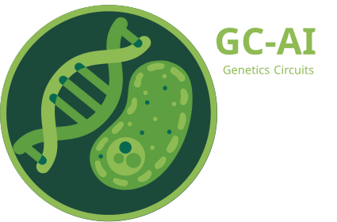

# GC-AI 

**GC-AI** is a web application designed for symbol detection and SBOL3 file generation.

## 📖 Table of Contents

-  [Features](#features)
-  [Requirements](#requirements)
-  [Installation](#installation)
-  [Usage](#usage)
-  [API Endpoints](#api-endpoints)
-  [Project Structure](#project-structure)
-  [Documentation](#documentation)
-  [License](#license)

---

## 🖥️ Features

- **Symbol Detection**: Leverages a trained ML model to identify and classify symbols in input images.
- **SBOL3 File Generation**: Creates SBOL3 files based on user input and system rules.
- **File Conversion**: Converts SBOL3 files to GenBank and/or FASTA formats.
- **Health Check**: Provides an endpoint to verify the application's health.
- **Database Integration**: Interacts with a MySQL database to retrieve and store relevant data.

---

## ⚙️ Installation 

The installation and setup of this application for local use are provided in the following repository:

- [GC-AI Environment](https://github.com/cvtalrc/GC-AI-environment)

Please refer to that repository for detailed instructions on setting up and running the application.

---

## 🔗 API Endpoints

### 1. Component Endpoints

#### 1.1 Get Component Names
- **Path:** `/names`
- **Method:** `GET`
- **Description:** Returns a list of part names based on a specific role.

#### 1.2 Get Interaction Participations
- **Path:** `/interactions`
- **Method:** `GET`
- **Description:** Returns participation types for a specific interaction type.

#### 1.3 Get Component Details
- **Path:** `/details`
- **Method:** `GET`
- **Description:** Returns details of a component based on its name.

---

### 2. File Endpoints

#### 2.1 Generate SBOL3 File
- **Path:** `/create`
- **Method:** `POST`
- **Description:** Generates validated SBOL3 files.

#### 2.2 Convert SBOL3 Files
- **Path:** `/convert`
- **Method:** `POST`
- **Description:** Converts SBOL3 files to GenBank and/or FASTA formats.

---

### 3. Inference Endpoints

#### 3.1 Process Image
- **Path:** `/`
- **Method:** `POST`
- **Description:** Processes an image and returns predictions.

---

### 4. Health Endpoints

#### 4.1 Healthcheck
- **Path:** `/`
- **Method:** `GET`
- **Description:** Checks the application's health and its services.

---

## 📁 Project Structure

 **`app/`**: Contains the main application code, including subdirectories:
  -  **`data_configs/`**: Configuration files for data management.
  -  **`files_converted/`**: Stores converted files.
  -  **`files_generated/`**: Stores generated files like SBOL3 outputs.
  -  **`models/`**: Machine learning models and related files.
  -  **`routes/`**: API route definitions.
  -  **`utils/`**: Utility scripts for backend operations.
-  **`run.py`**: Entry point for the backend.
-  **`requirements.txt`**: Lists all dependencies.
-  **`gc-ai-backend.log`**: Log file for backend operations.

---

## 📚 Documentation

For a detailed API reference, user guide, and additional resources, visit the `docs` folder in this repository. This folder includes:

-  **API Documentation:** Detailed explanations of each endpoint, including parameters, request examples, and responses.
-  **User Guide:** Step-by-step instructions on how to use the application.
-  **Examples Folder:** Contains example files and use cases to better understand the functionality.

 **Video Tutorial:** [https://drive.google.com/file/d/1HaAMEEK1RPH6OgdfUJZEpdy9fs_9gR0N/view?usp=sharing.](https://drive.google.com/file/d/1arsPDjiq3L0xUiLrLLDwt6Qws6lDpU9x/view?usp=sharing)

## 📝 License

This project is licensed under the MIT License. See the `LICENSE` file for details.
